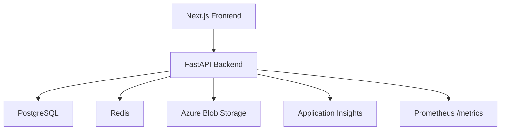

# Drive — Cloud Storage Platform

Production-grade cloud storage platform with file management, collaboration, version history, and full-text search.



## Features

- **Authentication** — JWT with refresh token rotation, Argon2 password hashing, RBAC (admin/user/viewer)
- **File Management** — Upload, download, move, copy, rename, delete, streaming with SHA-256 checksums
- **Folder Hierarchy** — Unlimited nesting, recursive operations, breadcrumbs, folder size calculation
- **Trash System** — Soft delete, restore, permanent delete, empty trash with orphan cleanup
- **Version History** — Immutable versions, restore via blob copy, current version pointer
- **Collaboration** — Share files/folders, inherited permissions, ownership transfer
- **Shared Links** — Public and private links, password protection, expiry, download limits
- **Search** — Filename, extension, MIME type, tags, favorites, permission-aware filtering
- **Observability** — Structured JSON logging, correlation IDs, Prometheus metrics, OpenTelemetry tracing
- **Security** — Rate limiting, security headers, input validation, path traversal protection

## Tech Stack

| Layer | Technology |
|---|---|
| Backend | FastAPI, SQLAlchemy 2.x, Alembic, Pydantic v2 |
| Database | PostgreSQL 16 |
| Cache | Redis 7 |
| Storage | Azure Blob Storage |
| Auth | JWT, Argon2 |
| Observability | structlog, Prometheus, OpenTelemetry |
| Frontend | Next.js 15, TypeScript, TailwindCSS |
| IaC | Terraform |
| CI/CD | GitHub Actions |

## Quick Start

```bash
cp .env.example .env
docker compose up --build
```

- Frontend: http://localhost:3000
- API Docs: http://localhost:8000/docs
- Health: http://localhost:8000/api/v1/health
- Metrics: http://localhost:8000/metrics

## Project Documentation

| Document | Purpose |
|---|---|
| [ARCHITECTURE_DECISIONS.md](ARCHITECTURE_DECISIONS.md) | Architecture Decision Records |
| [CHANGELOG.md](CHANGELOG.md) | Release history |
| [CONTRIBUTING.md](CONTRIBUTING.md) | Development guide |
| [DEPLOYMENT.md](DEPLOYMENT.md) | Azure deployment guide |
| [PERFORMANCE.md](PERFORMANCE.md) | Performance characteristics |
| [SECURITY.md](SECURITY.md) | Security architecture |
| [OBSERVABILITY.md](OBSERVABILITY.md) | Monitoring and logging |
| [RELEASE.md](RELEASE.md) | Release checklist |

## Project Structure

```
Drive/
├── backend/
│   ├── app/
│   │   ├── api/v1/          # REST endpoints
│   │   ├── config/          # Settings (Pydantic)
│   │   ├── core/            # Logging, exceptions, cache, retry
│   │   ├── dependencies/    # DI (auth, db, redis, storage, permissions)
│   │   ├── middleware/       # ASGI middleware
│   │   ├── models/          # SQLAlchemy ORM models
│   │   ├── repositories/    # Data access (Repository Pattern)
│   │   ├── schemas/         # Pydantic DTOs
│   │   ├── services/        # Business logic
│   │   └── storage/         # Storage abstraction + Azure
│   ├── migrations/          # Alembic
│   └── tests/
├── frontend/                # Next.js App Router
├── infra/terraform/         # Azure IaC
├── .github/                 # CI/CD workflows, templates
├── docker-compose.yml       # Development
├── docker-compose.prod.yml  # Production
└── README.md
```

## API Endpoints

### Authentication
| Method | Path | Description |
|---|---|---|
| POST | /api/v1/auth/register | Register |
| POST | /api/v1/auth/login | Login |
| POST | /api/v1/auth/refresh | Refresh tokens |
| POST | /api/v1/auth/logout | Logout |
| GET | /api/v1/auth/me | Current user |

### Files
| Method | Path | Description |
|---|---|---|
| POST | /api/v1/files/upload | Upload file |
| GET | /api/v1/files | List files |
| GET | /api/v1/files/{id} | File metadata |
| GET | /api/v1/files/{id}/download | Download (streaming) |
| PATCH | /api/v1/files/{id}/metadata | Update metadata |
| DELETE | /api/v1/files/{id} | Move to trash |
| POST | /api/v1/files/{id}/move | Move |
| POST | /api/v1/files/{id}/copy | Copy |
| POST | /api/v1/files/{id}/restore | Restore |
| DELETE | /api/v1/files/{id}/permanent | Permanent delete |
| POST | /api/v1/files/{id}/rename | Rename |

### Folders
| Method | Path | Description |
|---|---|---|
| POST | /api/v1/folders | Create |
| GET | /api/v1/folders | List |
| GET | /api/v1/folders/{id} | Details |
| PATCH | /api/v1/folders/{id} | Update |
| DELETE | /api/v1/folders/{id} | Move to trash |
| GET | /api/v1/folders/{id}/breadcrumbs | Breadcrumbs |
| GET | /api/v1/folders/{id}/size | Size calculation |
| GET | /api/v1/folders/{id}/children | Children |
| GET | /api/v1/folders/trash/all | Trash listing |
| POST | /api/v1/folders/trash/empty | Empty trash |

### Versions
| Method | Path | Description |
|---|---|---|
| GET | /api/v1/versions/file/{id} | List versions |
| GET | /api/v1/versions/{id} | Version metadata |
| GET | /api/v1/versions/{id}/download | Download version |
| POST | /api/v1/versions/{id}/restore | Restore version |
| DELETE | /api/v1/versions/{id} | Delete version |

### Discovery
| Method | Path | Description |
|---|---|---|
| GET | /api/v1/search | Search files |
| GET | /api/v1/search/suggestions | Autocomplete |
| GET | /api/v1/favorites | List favorites |
| POST | /api/v1/favorites/{id} | Add favorite |
| DELETE | /api/v1/favorites/{id} | Remove favorite |
| GET | /api/v1/recent | Recent files |
| GET | /api/v1/tags | List tags |
| POST | /api/v1/tags | Create tag |

### Health
| Method | Path | Description |
|---|---|---|
| GET | /api/v1/health | Basic health |
| GET | /api/v1/live | Liveness |
| GET | /api/v1/ready | Readiness (DB/Redis/Storage) |
| GET | /api/v1/startup | Startup probe |
| GET | /metrics | Prometheus metrics |

## Testing

```bash
cd backend
pip install -e ".[dev]"
pytest tests/ -v --cov=app --cov-report=term
```

## Deployment

See [DEPLOYMENT.md](DEPLOYMENT.md) for Azure deployment instructions using Terraform and GitHub Actions.

## License

MIT — See [LICENSE](LICENSE)
