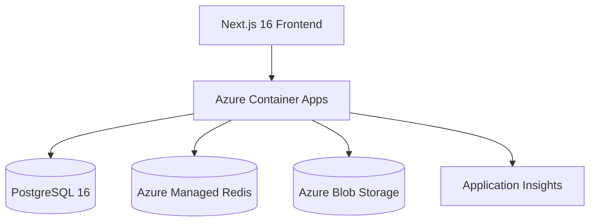

# Drive — Cloud Storage Platform

Production-grade cloud storage platform with file management, real-time collaboration, version history, full-text search, and enterprise-grade observability.



## Features

- **Authentication** — JWT with refresh token rotation, Argon2 password hashing, RBAC
- **File Management** — Upload, download, move, copy, rename, delete with SHA-256 checksums
- **Folder Hierarchy** — Unlimited nesting, breadcrumbs, recursive operations
- **Trash System** — Soft delete, restore, permanent delete, empty trash
- **Version History** — Immutable versions, restore via blob copy
- **Collaboration** — Share files/folders, inherited permissions, ownership transfer
- **Shared Links** — Public/private links, password protection, expiry
- **Search** — Full-text search, tags, favorites, permission-aware filtering
- **Observability** — Structured JSON logging, correlation IDs, OpenTelemetry tracing
- **Security** — Rate limiting, security headers, input validation, CORS

## Tech Stack

| Layer | Technology |
|---|---|
| Frontend | Next.js 16, React 19, TypeScript, TailwindCSS 3 |
| Backend | FastAPI, Python 3.13, SQLAlchemy 2.x (async), Pydantic v2 |
| Database | PostgreSQL 16 (Azure Flexible Server) |
| Cache | Azure Managed Redis (Balanced_B0) |
| Storage | Azure Blob Storage |
| Auth | JWT (python-jose), Argon2 (passlib) |
| Observability | structlog, OpenTelemetry, Application Insights |
| IaC | Terraform (azurerm v4, azapi v2) |
| CI/CD | GitHub Actions |
| Container | Docker (multi-stage builds) |

## Quick Start

```bash
cp .env.example .env
docker compose up --build
```

- Frontend: http://localhost:3000
- API Docs: http://localhost:8000/docs
- Health: http://localhost:8000/api/v1/health
- Metrics: http://localhost:8000/metrics

## Project Structure

```
├── backend/
│   ├── app/
│   │   ├── api/v1/           # REST endpoints (auth, files, folders, collaboration, versions, discovery)
│   │   ├── services/         # Business logic
│   │   ├── repositories/     # Data access (Repository pattern)
│   │   ├── models/           # SQLAlchemy ORM models
│   │   ├── schemas/          # Pydantic DTOs
│   │   ├── middleware/       # ASGI middleware (security, logging, rate limiting)
│   │   ├── dependencies/     # Dependency injection
│   │   ├── storage/          # Blob storage abstraction + Azure implementation
│   │   ├── auth/             # JWT + password utilities
│   │   ├── config/           # Pydantic Settings
│   │   └── core/             # Logging, exceptions, OpenTelemetry
│   ├── migrations/           # Alembic
│   ├── tests/                # pytest (215 tests)
│   └── Dockerfile.prod
├── frontend/
│   ├── app/                  # Next.js App Router
│   │   ├── (auth)/           # Login, Register
│   │   └── (dashboard)/      # Drive, Recent, Shared, Trash, Settings
│   ├── components/           # UI, Layout, Files, Auth
│   ├── contexts/             # Auth, Toast
│   ├── hooks/                # React Query hooks
│   ├── services/             # API layer with JWT interceptor
│   └── types/                # TypeScript interfaces
├── infra/terraform/          # Azure IaC
├── scripts/                  # Deployment validation
├── docs/                     # Architecture, Release notes
├── .github/                  # CI/CD workflows, templates
└── docker-compose.yml        # Development
    docker-compose.prod.yml   # Production simulation
```

## Local Development

```bash
# Backend
cd backend
python -m venv .venv && source .venv/bin/activate
pip install -r requirements.txt
alembic upgrade head
uvicorn app.main:app --reload --port 8000

# Frontend
cd frontend
npm install
npm run dev
```

## Testing

```bash
# Backend (215 tests)
cd backend
pip install pytest pytest-asyncio pytest-cov
pytest tests/ -v --cov=app

# Frontend
cd frontend
npm run lint
npm run build
```

## Deployment

```bash
# 1. Apply infrastructure
cd infra/terraform
terraform plan
terraform apply

# 2. Deploy application (automated via GitHub Actions)
git push origin main

# 3. Validate deployment
bash scripts/validate_deployment.sh
```

## Azure Architecture

| Resource | SKU | Purpose |
|---|---|---|
| Container App (backend) | 0.5 CPU, 1Gi | FastAPI |
| Container App (frontend) | 0.5 CPU, 1Gi | Next.js |
| PostgreSQL Flexible Server | B_Standard_B1ms | Database |
| Managed Redis | Balanced_B0 | Rate limiting |
| Storage Account | Standard LRS | Blob storage |
| Key Vault | Standard | Secrets |
| Container Registry | Basic | Docker images |
| Application Insights | — | Observability |
| Log Analytics | PerGB2018 | Centralized logs |

## API Endpoints (59 total)

See interactive docs at `/docs` when running locally.

| Group | Prefix | Endpoints |
|---|---|---|
| Auth | `/auth` | register, login, refresh, logout, me |
| Files | `/files` | upload, list, get, download, delete, rename, move, copy, restore |
| Folders | `/folders` | create, list, get, delete, rename, breadcrumbs, trash |
| Collaboration | `/collaboration` | share, permissions, links, ownership transfer |
| Versions | `/versions` | list, get, download, restore, delete |
| Discovery | `/` | search, suggestions, tags, favorites, recent, metadata |

## CI/CD

| Workflow | Trigger | Purpose |
|---|---|---|
| `ci.yml` | PR + push to main | Lint, test, Docker build |
| `cd.yml` | Push to main + tags | Build, push to ACR, deploy, health check |
| `validate-deployment.yml` | Manual | 12-step smoke test against production |

## Documentation

| Document | Purpose |
|---|---|
| [ARCHITECTURE_DECISIONS.md](ARCHITECTURE_DECISIONS.md) | Architecture Decision Records |
| [docs/architecture.md](docs/architecture.md) | Full system architecture |
| [docs/RELEASE.md](docs/RELEASE.md) | Release notes |
| [CONTRIBUTING.md](CONTRIBUTING.md) | Development guide |
| [SECURITY.md](SECURITY.md) | Security architecture |
| [CHANGELOG.md](CHANGELOG.md) | Release history |

## License

MIT — See [LICENSE](LICENSE)
