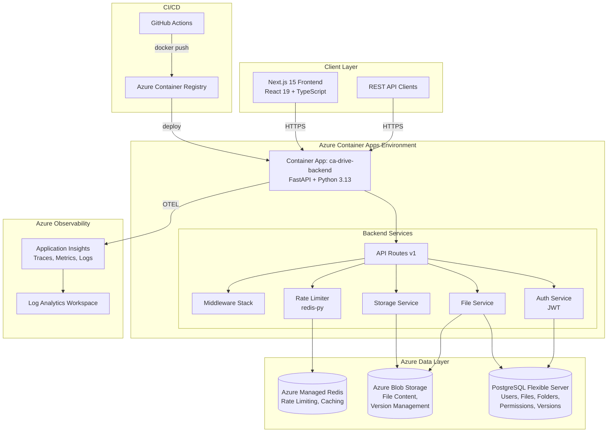
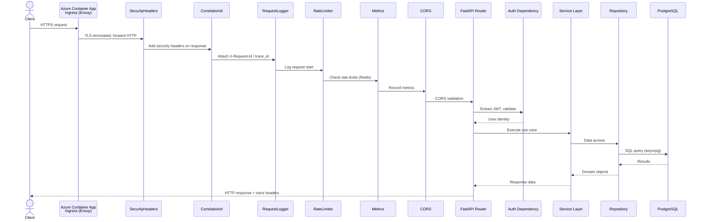
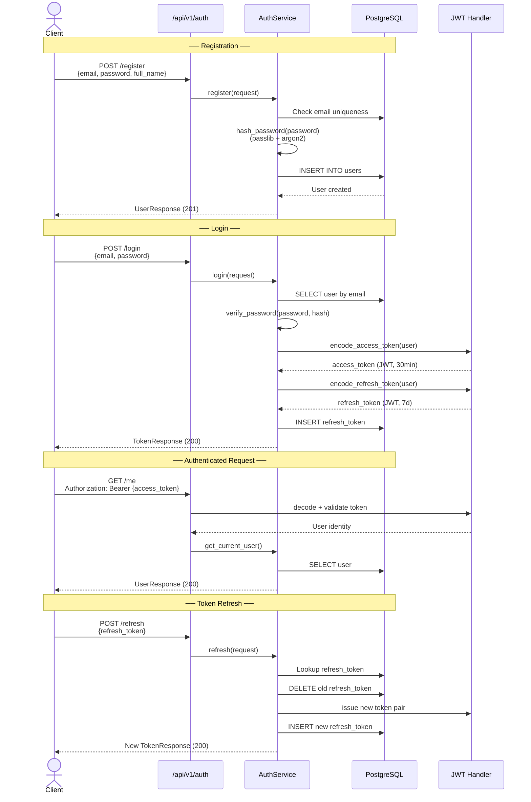
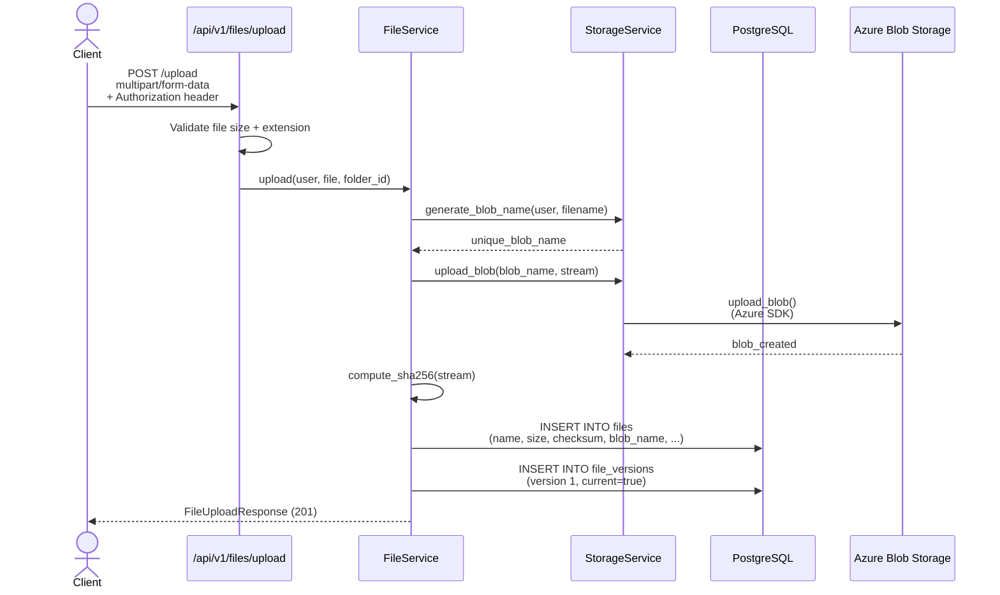
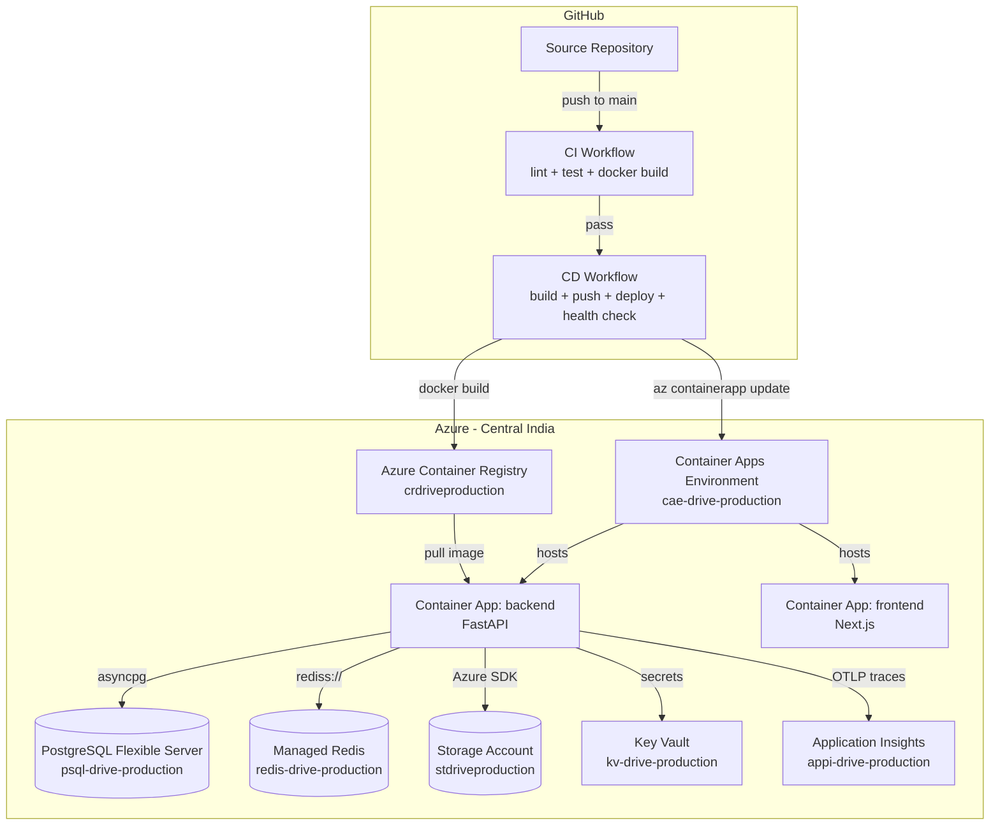
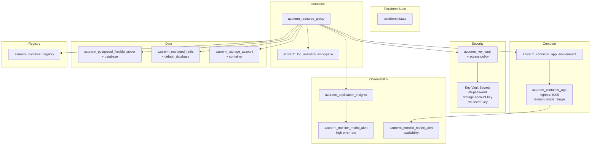
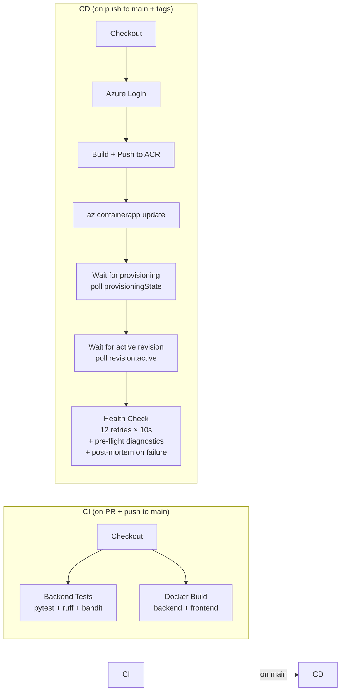
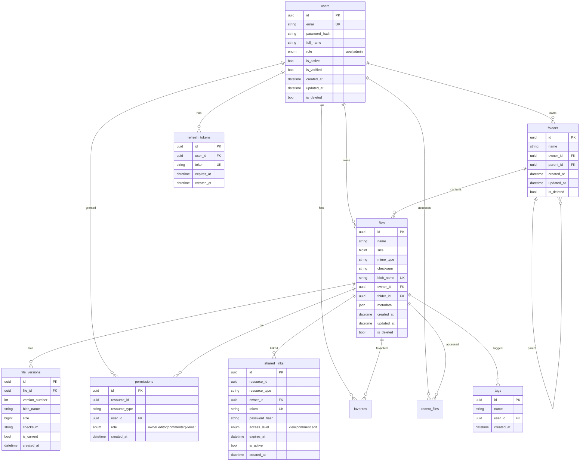

# Architecture Document — Drive

---

## 1. High-Level System Architecture

```
┌──────────────┐     ┌──────────────────────┐     ┌─────────────────────────┐
│   Frontend   │────▶│   Azure Container App  │────▶│   Azure Blob Storage     │
│  Next.js 15  │     │  (FastAPI / Python)    │     │   (File Content)         │
│  React 19    │     │                        │     └─────────────────────────┘
│  TypeScript  │     │  ┌──────────────────┐  │
└──────────────┘     │  │  Rate Limiter    │──│───▶  Azure Managed Redis
                     │  │  (redis-py)      │  │      (Rate Limits + Cache)
                     │  └──────────────────┘  │
                     │                        │
                     │  ┌──────────────────┐  │     ┌─────────────────────────┐
                     │  │  Auth Service    │  │     │  PostgreSQL Flexible    │
                     │  │  (JWT / PyJWT)   │──│────▶│  Server                 │
                     │  └──────────────────┘  │     │  (Users, Files, Folders) │
                     │                        │     └─────────────────────────┘
                     │  ┌──────────────────┐  │
                     │  │  File Service    │  │     ┌─────────────────────────┐
                     │  │  (Storage Layer) │──│────▶│  Azure App Insights     │
                     │  └──────────────────┘  │     │  (Traces, Metrics)      │
                     └────────────────────────┘     └─────────────────────────┘
```



## 2. Request Flow



## 3. Authentication Flow



## 4. Upload Flow



## 5. Deployment Architecture



## 6. Azure Resources

| Resource | Name | SKU / Tier | Purpose |
|---|---|---|---|
| Resource Group | `rg-drive-production` | — | Logical container |
| Container App Environment | `cae-drive-production` | — | Hosts container apps |
| Container App (Backend) | `ca-drive-backend` | 0.5 CPU, 1Gi, 1–3 replicas | FastAPI application |
| Container App (Frontend) | `ca-drive-frontend` (planned) | — | Next.js SSR |
| Container Registry | `crdriveproduction` | Basic | Docker image storage |
| PostgreSQL Flexible Server | `psql-drive-production` | B_Standard_B1ms, v16 | Users, files, folders, permissions, versions |
| Managed Redis | `redis-drive-production` | Balanced_B0 | Rate limiting, caching |
| Storage Account | `stdriveproduction` | Standard LRS | Blob storage for files |
| Key Vault | `kv-drive-production` | Standard | Secrets (JWTs, passwords, storage keys) |
| Log Analytics Workspace | `log-drive-production` | PerGB2018 | Centralized logs |
| Application Insights | `appi-drive-production` | — | Traces, metrics, alerts |

### Container App Ingress

| Setting | Value |
|---|---|
| External ingress | Enabled |
| Target port | 8000 |
| Transport | Auto (HTTP/2 → HTTP/1.1 fallback) |
| Traffic weight | 100% → latest revision |
| Revision mode | Single |

### Backend Environment Variables

| Variable | Source | Encrypted |
|---|---|---|
| `ENVIRONMENT` | Literal `production` | No |
| `DB_HOST` | PostgreSQL FQDN | No |
| `DB_PORT` | `5432` | No |
| `DB_USER` | `drive_admin` | No |
| `DB_PASSWORD` | Key Vault secret `db-password` | Yes |
| `DB_NAME` | `drive` | No |
| `REDIS_HOST` | Managed Redis hostname | No |
| `REDIS_PORT` | `6380` | No |
| `REDIS_SSL` | `true` | No |
| `REDIS_PASSWORD` | Key Vault secret `redis-password` | Yes |
| `JWT_SECRET_KEY` | Key Vault secret `jwt-secret` | Yes |
| `AZURE_STORAGE_ACCOUNT_NAME` | Storage account name | No |
| `AZURE_STORAGE_ACCOUNT_KEY` | Key Vault secret `storage-key` | Yes |
| `AZURE_APPINSIGHTS_CONNECTION_STRING` | App Insights | No |
| `OTEL_ENABLED` | `true` | No |
| `WORKERS` | `1` | No |

## 7. Terraform Architecture



**Provisioning order**: Resource Group → Log Analytics / Key Vault → PostgreSQL / Redis / Storage / ACR → Container App Environment → Container App → Alerts.

**Sensitive outputs**: `acr_admin_password`, `storage_account_key`, `container_app_fqdn`.

## 8. CI/CD Pipeline



### CD Health Check Details

1. **Pre-flight diagnostics** (before first curl):
   - DNS resolution of Container App FQDN
   - Container App status (provisioning state, FQDN, target port)
   - Revision status table (name, active, replicas, health state)
   - Container logs (last 50 lines)

2. **Curl retry loop**: 12 attempts × `--connect-timeout 10 --max-time 20` × 10s sleep = ~2 minutes max

3. **Post-mortem diagnostics** (on failure):
   - Container App status snapshot
   - Revision table
   - Container logs (last 100 lines)
   - Last HTTP response body

4. **Validation script**: `scripts/validate_deployment.sh` (12-step smoke test, also available as `workflow_dispatch` in `validate-deployment.yml`)

## 9. Backend Layer Architecture

```
backend/
├── app/
│   ├── api/v1/           # Presentation — HTTP endpoints
│   │   ├── auth.py       #   /auth/{register,login,me,refresh,logout}
│   │   ├── files.py      #   /files/{upload,download,delete,copy,move,rename}
│   │   ├── folders.py    #   /folders/{create,list,delete,rename}
│   │   ├── collaboration.py  # /collaboration/{share,links,permissions}
│   │   ├── versions.py   #   /versions/{list,restore,download}
│   │   ├── discovery.py  #   /discovery/{search,recent,favorites,tags}
│   │   └── health.py     #   /health, /live, /ready, /startup
│   │
│   ├── services/         # Application — use case orchestration
│   │   ├── auth.py       #   Registration, login, token management
│   │   ├── file.py       #   Upload, download, metadata
│   │   ├── folder.py     #   CRUD, nesting
│   │   ├── sharing.py    #   Links, permissions, collaboration
│   │   ├── storage.py    #   Blob abstraction, checksums
│   │   ├── versioning.py #   Version tracking, restore
│   │   ├── discovery.py  #   Search, favorites, recent
│   │   └── audit.py      #   Audit logging
│   │
│   ├── repositories/     # Infrastructure — data access
│   │   ├── user.py
│   │   ├── file.py
│   │   ├── folder.py
│   │   ├── sharing.py
│   │   └── versioning.py
│   │
│   ├── models/           # Infrastructure — SQLAlchemy ORM
│   │   ├── base.py       #   Declarative base
│   │   ├── user.py       #   User, RefreshToken
│   │   ├── file.py       #   File, Folder
│   │   ├── sharing.py    #   Permission, SharedLink
│   │   ├── versioning.py #   FileVersion
│   │   └── discovery.py  #   Tag, Favorite, RecentFile
│   │
│   ├── schemas/          # Interface — Pydantic DTOs
│   │   ├── auth.py       #   RegisterRequest, LoginRequest, TokenResponse
│   │   ├── file.py       #   FileUploadResponse, FileMetadataResponse
│   │   └── ...
│   │
│   ├── middleware/        # Infrastructure — ASGI middleware
│   │   ├── security_headers.py      # HSTS, X-Frame-Options, CSP
│   │   ├── correlation_id.py        # X-Request-Id / trace_id
│   │   ├── request_logger.py        # Structured request logging
│   │   ├── rate_limiter.py          # Redis-backed rate limiting
│   │   ├── metrics.py               # Prometheus-compatible counters
│   │   └── timeout.py               # Request timeout (60s)
│   │
│   ├── auth/             # Infrastructure — JWT + password
│   │   ├── jwt.py        #   Token encode/decode
│   │   └── password.py   #   Argon2 hashing (passlib)
│   │
│   ├── storage/          # Infrastructure — blob abstraction
│   │   ├── base.py       #   StorageBackend interface
│   │   └── azure_blob.py #   Azure Blob Storage implementation
│   │
│   ├── dependencies/     # Shared — DI providers
│   │   ├── auth.py       #   get_current_user, require_role
│   │   ├── database.py   #   get_db (AsyncSession)
│   │   ├── redis.py      #   get_redis (async Redis client)
│   │   └── storage.py    #   get_storage_service
│   │
│   ├── core/             # Shared — config, utilities
│   │   ├── config/       #   Pydantic Settings
│   │   ├── logging_config.py  # structlog configuration
│   │   ├── otel.py       #   OpenTelemetry setup
│   │   ├── error_handlers.py  # Global exception handlers
│   │   └── exceptions.py      # AppError, StorageError, etc.
│   │
│   └── main.py           # Application factory + lifespan
│
├── migrations/           # Alembic database migrations
│   ├── env.py           # Async migration runner
│   └── versions/        # 001–007 migration scripts
│
├── tests/                # pytest + pytest-asyncio
│   ├── conftest.py      # Fixtures: test DB (SQLite), mock storage, auth
│   ├── test_health.py
│   ├── test_auth.py
│   ├── test_phase*.py   # Phase 1–7 feature tests
│   ├── test_storage.py
│   ├── test_middleware.py
│   ├── test_error_handlers.py
│   ├── test_regression_fixes.py
│   └── e2e/             # End-to-end tests
│
├── Dockerfile.prod       # Multi-stage production image
├── Dockerfile.dev        # Development hot-reload image
├── requirements.txt      # Pinned dependencies
├── pyproject.toml        # Python project config
└── alembic.ini           # Alembic configuration
```

## 10. Database Schema



## 11. Middleware Execution Order

Requests pass through middleware in this order:

```
Client Request
    │
    ▼
┌─────────────────────────┐
│ 1. RequestTimeout       │  60s timeout per request
├─────────────────────────┤
│ 2. SecurityHeaders      │  HSTS, XFO, XSS, CSP, cache-control
├─────────────────────────┤
│ 3. CorrelationId        │  X-Request-Id, X-Trace-Id headers
├─────────────────────────┤
│ 4. RequestLogger        │  Structured JSON logging (structlog)
├─────────────────────────┤
│ 5. RateLimiter          │  Redis-backed, path-specific limits
├─────────────────────────┤
│ 6. Metrics              │  Prometheus-compatible counters
├─────────────────────────┤
│ 7. CORS                 │  Origin validation
├─────────────────────────┤
│ FastAPI Router          │  JWT auth dependency → Service → Repository
└─────────────────────────┘
    │
    ▼
Client Response
```

## 12. Technology Stack Summary

| Layer | Technology | Version |
|---|---|---|
| **Backend Framework** | FastAPI | ≥0.115, <1.0 |
| **Python** | CPython | 3.13 |
| **ASGI Server** | Uvicorn | ≥0.30, <1.0 |
| **ORM** | SQLAlchemy (async) | ≥2.0.30, <3.0 |
| **Database Driver** | asyncpg | ≥0.29, <1.0 |
| **Migrations** | Alembic | ≥1.13, <2.0 |
| **Validation** | Pydantic | ≥2.7, <3.0 |
| **Configuration** | pydantic-settings | ≥2.3, <3.0 |
| **Auth — Hashing** | passlib + argon2 | ≥1.7.4, <2.0 |
| **Auth — Tokens** | python-jose + cryptography | ≥3.3, <4.0 |
| **Redis Client** | redis-py (async) | ≥5.0, <6.0 |
| **Blob Storage** | azure-storage-blob | ≥12.20, <13.0 |
| **Azure Identity** | azure-identity | ≥1.16, <2.0 |
| **Logging** | structlog | ≥24.2, <25.0 |
| **Tracing** | OpenTelemetry (API + SDK + OTLP) | ≥1.20, <2.0 |
| **HTTP Client** | httpx | ≥0.27, <1.0 |
| **Testing** | pytest + pytest-asyncio | — |
| **Frontend Framework** | Next.js | 15.x |
| **Frontend UI** | React | 19.x |
| **CSS** | Tailwind CSS | 3.4 |
| **IaC** | Terraform + azurerm | ≥1.5 / ~>4.0 |
| **CI/CD** | GitHub Actions | — |
| **Container Runtime** | Docker (multi-stage) | — |
